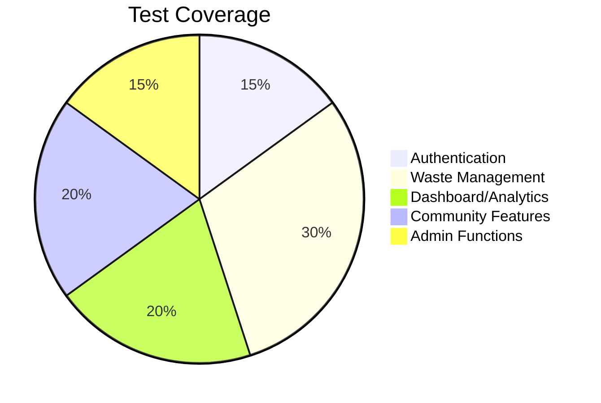

# CleanCity Test Plan

## 📋 Document Information
**Version:** 1.0  
**Date:** `2025-06-26`  
**Target Release:** v1.0  
**Test Team:**   Nompie Dube, Neo, Lusanda

---

## 🎯 1. Test Strategy
### 1.1 Testing Scope


### 1.2 Test Types
| **Type**          | **Tool**         | **Coverage Target** |
|-------------------|------------------|---------------------|
| Functional        | jest           | 100% FRs            |
| Performance      | Lighthouse       | Key user journeys   |
| Accessibility    | Axe, Pa11y       | WCAG 2.1 AA         |

---

## 🗓 2. Test Phases
### 2.1 Phase 1: Test Planning (Days 1-2)
#### Deliverables:
- [x] Traceability matrix (FR ↔ Test Cases)
- [x] `testdata/` directory structure:
  ```
  /testdata
    /auth
      valid_users.json
      invalid_users.json
    /pickups
      scheduling_rules.yaml
    /browsers
      compatibility_matrix.csv
  ```

#### GitHub Setup:
```bash
# Create issue templates
mkdir -p .github/ISSUE_TEMPLATES
touch .github/ISSUE_TEMPLATES/{test_case.md,defect_report.md}
```

---

## 🧪 3. Test Case Design
### 3.1 Authentication (FR-001 to FR-011)
**Sample Test Case:**
```markdown
### TC-AUTH-01: Valid User Registration
**Priority:** High  
**Linked FR:** FR-001, FR-003  
**Steps:**  
1. Enter valid email (test@example.com)  
2. Enter valid password (ValidPass123!)  
3. Fill required fields  
**Expected:**  
- Account created with "User" role  
- Redirect to dashboard  
```

### 3.2 Waste Management (FR-012 to FR-022)
**Edge Case Test:**
```markdown
### TC-WASTE-07: Hazardous Waste Approval Flow  
**Priority:** Critical  
**Linked FR:** FR-012, FR-015  
**Test Data:**  
- Waste type: "Batteries"  
- Date: Tomorrow  
**Expected:**  
- Status: "Pending Approval"  
- Admin notification triggered  
```

---

## 🛠️ 4. Test Environment
### 4.1 Browser Matrix
```csv
Browser,Version,OS,Test Cases
Chrome,125,Windows 11,All
Firefox,125,Ubuntu 22.04,TC-AUTH-*
Safari,17,MacOS,TC-WASTE-*
```

### 4.2 Device Testing
**Coverage:**
- Mobile: iPhone SE (375x667), Pixel 6 (412x915)
- Tablet: iPad Air (820x1180)
- Desktop: 1920x1080, 1440x900

---

## 🚦 5. Execution Plan
### 5.1 Test Cycle 1 (Sanity)
**Duration:** 1 day  
**Scope:**  
- Critical auth flows (FR-001 to FR-011)  
- Basic pickup scheduling (FR-012 to FR-015)  

### 5.2 Test Cycle 2 (Regression)
**Duration:** 3 days  
**Scope:**  
- All FRs with bug fixes  
- Cross-browser validation  

---

## 📈 6. Metrics & Reporting
| **Metric**          | **Target**       | **Measurement**          |
|---------------------|------------------|--------------------------|
| Requirement Coverage | ≥95%             | Jira Xray                |
| Defect Density      | <0.5/TC          | GitHub Projects          |
| Test Automation     | 70%              | Cypress Dashboard        |

---

## ⚠️ 7. Risk Management
| **Risk**                      | **Mitigation**                          |
|-------------------------------|-----------------------------------------|
| localStorage limitations      | Fallback to sessionStorage              |
| Timezone handling             | Test with UTC-12 to UTC+14              |
| Admin permission escalation   | Regular RBAC audits                     |

---

## ✅ 8. Exit Criteria
- All P0/P1 defects resolved  
- 95% FR coverage achieved  
- Accessibility score ≥90 (Lighthouse)  

---

## 🔗 9. Resources
1. [FRS Document](https://github.com/Nompie1993/CleanCity/blob/main/docs/functional-requirements.md)  
2. [Test Data Repo](https://github.com/your-repo/testdata)  
3. [Github Project](https://github.com/users/Nompie1993/projects/5)  

**Approval:**  
QA Lead: ___________________  
Dev Lead: ___________________  
```


