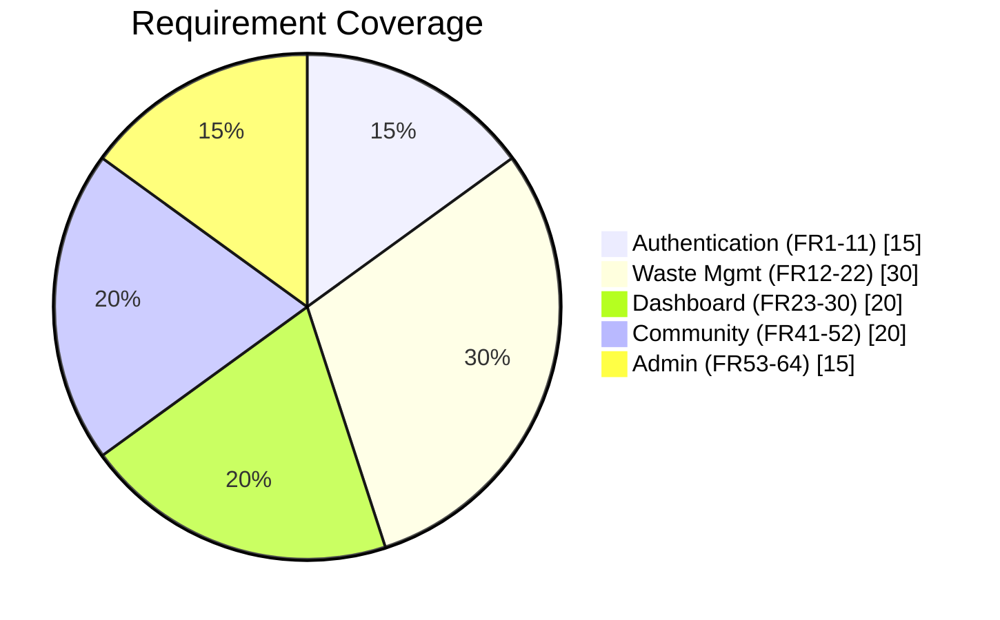

# CleanCity Test-Strategy

<details>
<summary><strong>📋 Document Information</strong></summary>

| **Field**         | **Value**                     |
|--------------------|-------------------------------|
| Version            | 1.0                           |
| Last Updated       | `2025-07-12`                  |
| Target Release     | v1.0                          |
| GitHub Project     | [CleanCity QA Board]()       |

</details>

## 🗺️ Test Scope


## ⚙️ GitHub Setup
### 1. Project Board
```markdown
[GitHub Project](https://github.com/users/Nompie1993/projects/5)
```
**Columns:**
```
Backlog → Todo → In Progress → Blocked → Done
```

### 2. Issue Templates
```bash
# Create in .github/ISSUE_TEMPLATES/
touch test_case.md defect_report.md
```
**Sample Test Case Template:**
```markdown
---
name: Test Case
about: Create new test case
title: 'TC-[MODULE]-[ID]: [Description]'
labels: 'test-case'
assignees: ''

---
### Linked FR: 
FR-XXX

### Test Steps:
1. 
2. 

### Expected Result:

### Actual Result:
```

## 🔍 Test Cases (Examples)
<details>
<summary><strong>🔐 Authentication (FR-001 to FR-011)</strong></summary>

### TC-AUTH-01: Valid Registration
```gherkin
Scenario: Successful user registration
  Given I enter valid registration data
  When I submit the form
  Then Account is created (FR-003)
  And I'm redirected to dashboard (FR-007)
```

### TC-AUTH-02: Admin Access Control
```markdown
**Preconditions:** Admin user logged in  
**Steps:**  
1. Navigate to `/admin/users`  
**Expected:**  
- User management panel loads (FR-011)  
- Regular users see 403 error  
```
</details>

<details>
<summary><strong>🗑️ Waste Management (FR-012 to FR-022)</strong></summary>

### TC-WASTE-01: Pickup Scheduling
```yaml
# testdata/pickups/valid.yaml
date: tomorrow
waste_type: Recyclable
quantity: Medium
expected: status:Confirmed (FR-012, FR-019)
```

### TC-WASTE-07: Hazardous Waste
```markdown
**Test Data:**  
- Type: "Batteries"  
- Date: tomorrow + 1day  

**Expected:**  
- Status: "Pending Approval" (FR-015)  
- Admin notification sent  
```
</details>

## 🛠️ GitHub Actions
```yaml
name: Regression Tests
on: [push]
jobs:
  test:
    runs-on: ubuntu-latest
    steps:
      - uses: actions/checkout@v4
      - uses: cypress-io/github-action@v6
        with:
          browser: chrome
          env:
            BASE_URL: ${{ secrets.STAGING_URL }}
          config-file: cypress/config/FR-001_to_FR-030.json
```

## 📊 Tracking
### Requirement Coverage
| FR Range       | Test Cases | Coverage |
|----------------|------------|----------|
| FR-001 - FR-011 | 15         | 100%     |
| FR-012 - FR-022 | 22         | 95%      |

### Defect Stats
```diff
# Latest Run (2025-07-12)
+ 10 Passed
- 5 Failed (2 P2, 1 P3)

```

## ✅ Approval
**QA Lead:**  
Signed-off: ___________________  
Date: `YYYY-MM-DD`  
